# Dokumentacija projekta: Student Performance Prediction

## 1. Uvod

Cilj projekta je predikcija završne ocene učenika, označene atributom `G3`, na osnovu podataka iz skupa `student-por.csv`. Problem je regresionog tipa, jer se predviđa numerička vrednost ocene na skali od 0 do 20, a ne pripadnost unapred definisanoj klasi.

Projekat obuhvata ceo tok rada nad podacima: početnu proveru i obradu dataset-a, eksplorativnu analizu, podelu na trening, validacioni i test skup, treniranje više regresionih modela, poređenje performansi, podešavanje hiperparametara, analizu značajnosti atributa i izbor finalnog modela.

Posebna pažnja posvećena je poređenju dva scenarija:

- `with_G1_G2`: model koristi prethodne ocene `G1` i `G2`;
- `without_G1_G2`: model ne koristi prethodne ocene `G1` i `G2`.

Ovakvo poređenje je važno zato što `G1` i `G2` nose najbitnije informacije o završnoj oceni (prethodne ocene), ali u nekim praktičnim situacijama te ocene možda još nisu dostupne.

## 2. Opis skupa podataka

Korišćen je skup podataka `data/raw/student-por.csv`.
Atributi u dataset-u mogu se grupisati u nekoliko celina:

- lični i demografski podaci učenika: `age`, `sex`, `address`, `famsize`, `Pstatus`;
- porodično okruženje: `Medu`, `Fedu`, `Mjob`, `Fjob`, `guardian`, `famrel`;
- školske i obrazovne karakteristike: `school`, `reason`, `traveltime`, `studytime`, `failures`, `schoolsup`, `higher`;
- vannastavne i socijalne karakteristike: `activities`, `internet`, `romantic`, `freetime`, `goout`;
- zdravstveni i drugi faktori: `health`, `absences`, `Dalc`, `Walc`;
- ocene učenika: `G1`, `G2`, `G3`.

Detaljan pregled svih kolona, tipova podataka, broja jedinstvenih vrednosti i upotrebe po scenarijima nalazi se u `data/logs/step01_data_preparation/features_overview.csv`.

Sažetak iz `data/logs/step01_data_preparation/dataset_overview.csv`:

| Opis | Vrednost |
| --- | ---: |
| Broj redova | 649 |
| Broj kolona | 33 |
| Broj numeričkih kolona | 16 |
| Broj kategorijskih kolona | 17 |
| Broj duplikata | 0 |
| Ukupan broj nedostajućih vrednosti | 0 |
| Minimalna završna ocena `G3` | 0 |
| Maksimalna završna ocena `G3` | 19 |
| Prosečna završna ocena `G3` | 11.91 |

Prema `features_overview.csv`, svi atributi osim `G3` mogu biti ulazni atributi u scenariju sa `G1/G2`. U scenariju bez `G1/G2`, iz ulaza se dodatno uklanjaju `G1` i `G2`.

## 3. Početno preprocesiranje podataka

U koraku početne pripreme provereni su nedostajuće vrednosti, duplikati, osnovni opsezi ocena i očigledne greške za uklanjanje. Prema `data/logs/step01_data_preparation/preprocessing_report.csv`, dataset nema nedostajuće vrednosti ni duplikate, a ocene `G1`, `G2` i `G3` nalaze se u očekivanom opsegu 0-20.

| Provera | Rezultat |
| --- | --- |
| Missing vrednosti | 0 |
| Duplikati | 0 |
| `G1` van opsega 0-20 | Ne |
| `G2` van opsega 0-20 | Ne |
| `G3` van opsega 0-20 | Ne |
| Kandidati za uklanjanje | Nema |

Zaključak početne provere je da nema očiglednih grešaka koje zahtevaju ručno uklanjanje. Nisu pronađene tehničke ID kolone, konstantne kolone, duplikati ni vrednosti van osnovnih očekivanih opsega. Maksimalan broj izostanaka je 32, što se posmatra kao potencijalno ekstremna, ali moguća realna vrednost, pa nije automatski uklonjena.

Ekstremna vrednost ne mora da znači grešku, a uklanjanje atributa bez prethodne analize može izbaciti korisne informacije. Zbog toga su svi relevantni atributi zadržani za početno modelovanje, dok je njihov značaj kasnije analiziran kroz feature importance i top features scenarije.

Enkodiranje kategorijskih atributa i skaliranje numeričkih atributa nisu urađeni unapred nad celim datasetom. Umesto toga, `OneHotEncoder` i `StandardScaler` koriste se kasnije unutar `sklearn Pipeline` objekata tokom treniranja modela.

`StandardScaler` se koristi za numeričke atribute. On transformiše vrednosti tako da svaka numerička kolona ima srednju vrednost približno 0 i standardnu devijaciju približno 1. 
Standardna devijacija pokazuje koliko su vrednosti u nekoj koloni prosečno rasute oko srednje vrednosti. Mala standardna devijacija znači da su vrednosti blizu proseka, dok velika standardna devijacija znači da su vrednosti više rasute. 

Formula transformacije je:

```text
z = (x - mean) / standard_deviation
x-originalna vrednost nekog atributa
z-nova skalirana vrednost
```

Ovo je važno zato što neki modeli, posebno linearni modeli kao što je `Ridge Regression`, mogu biti osetljivi na razmere atributa. Na primer, atribut `absences` može imati drugačiji opseg vrednosti od atributa kao što su `studytime` ili `failures`. Skaliranjem se numerički atributi dovode na uporedivu skalu.

`OneHotEncoder` se koristi za kategorijske atribute. Modeli mašinskog učenja ne mogu direktno da koriste tekstualne kategorije kao što su `school = GP`, `sex = F` ili `internet = yes`. `OneHotEncoder` svaku kategoriju pretvara u posebnu binarnu kolonu. Na primer, atribut `internet` sa vrednostima `yes` i `no` može postati dve kolone: `internet_yes` i `internet_no`, gde vrednost 1 označava da učenik pripada toj kategoriji, a 0 da ne pripada.

Preprocessing nije primenjen unapred nad celim datasetom zato što bi to moglo da dovede do data leakage-a. Data leakage nastaje kada informacije iz validacionog ili test skupa, koje bi trebalo da budu nepoznate tokom treniranja, indirektno utiču na pripremu modela.

Kod `StandardScaler`-a bi leakage nastao ako bi se srednja vrednost i standardna devijacija računale nad celim datasetom pre treniranja. U tom slučaju bi skaliranje trening podataka već sadržalo informacije iz validacionog i test skupa.

Kod `OneHotEncoder`-a leakage nije uvek toliko izražen kao kod skaliranja, jer se ne računaju numeričke statistike poput srednje vrednosti i standardne devijacije. Ipak, ispravan princip je isti: skup kategorija koje encoder poznaje treba naučiti samo iz trening podataka. Ako bi se encoder fitovao nad celim datasetom, trening faza bi indirektno znala koje kategorije postoje u validacionom i test delu.

Zato su transformacije smeštene u `Pipeline`. Pipeline obezbeđuje da se `StandardScaler` i `OneHotEncoder` fituju samo na trening delu podataka. Nakon toga se ista naučena transformacija primenjuje na validation, test i kasnije na nove korisničke unose. Na taj način validation i test skup ostaju nezavisni i služe za realniju procenu kvaliteta modela.

## 4. Eksplorativna analiza podataka

Eksplorativna analiza podataka, odnosno EDA (Exploratory Data Analysis), sprovedena je u koraku `step02_eda.py`, a sažetak se nalazi u `data/logs/step02_eda/eda_report.csv`. Cilj EDA faze je da se pre modelovanja bolje razume struktura dataset-a, raspodela ciljne promenljive, odnosi između atributa i moguće ekstremne vrednosti.

| Pokazatelj | Vrednost |
| --- | ---: |
| Broj učenika | 649 |
| Prosečna `G3` ocena | 11.91 |
| Broj učenika sa `G3 = 0` | 15 |
| Procenat učenika sa `G3 = 0` | 2.31% |
| Korelacija `G1` i `G3` | 0.83 |
| Korelacija `G2` i `G3` | 0.92 |
| Korelacija `failures` i `G3` | -0.39 |
| Korelacija `studytime` i `G3` | 0.25 |
| Korelacija `absences` i `G3` | -0.09 |

`Korelacija` meri jačinu i smer linearne veze između dve numeričke promenljive. Vrednost korelacije se kreće od -1 do 1. Pozitivna korelacija znači da rast jedne promenljive uglavnom prati rast druge promenljive, dok negativna korelacija znači da rast jedne promenljive uglavnom prati pad druge. Vrednosti bliže 1 ili -1 ukazuju na jaču linearnu vezu, dok vrednosti blizu 0 ukazuju na slabu linearnu vezu.

Distribucija završne ocene prikazuje raspored vrednosti ciljne promenljive `G3`:

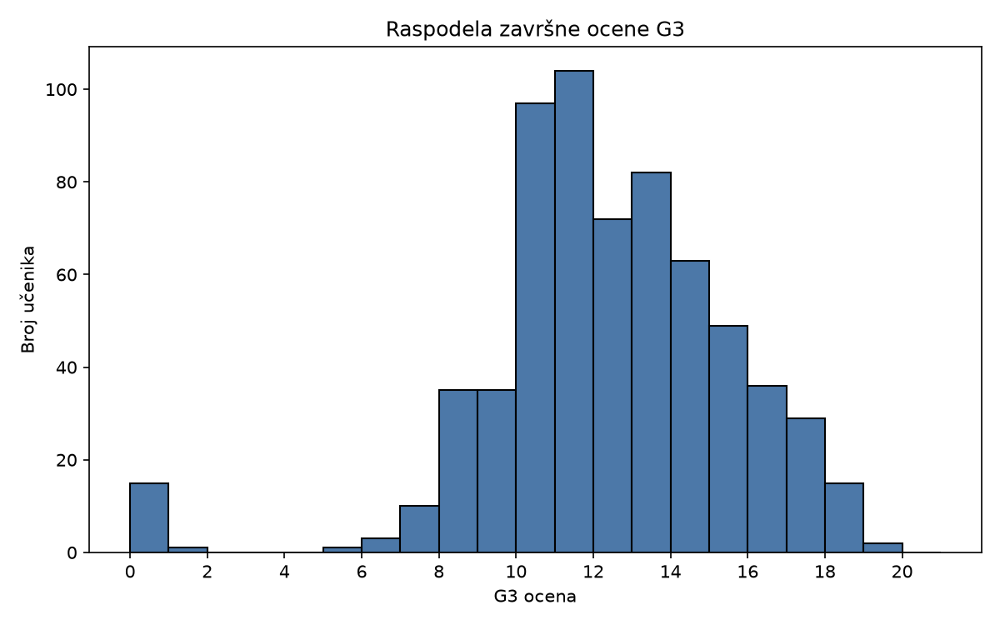

Korelaciona matrica numeričkih atributa pokazuje međusobne korelacije numeričkih promenljivih. Iz nje se vidi da su `G1` i naročito `G2` najjače povezani sa završnom ocenom `G3`:

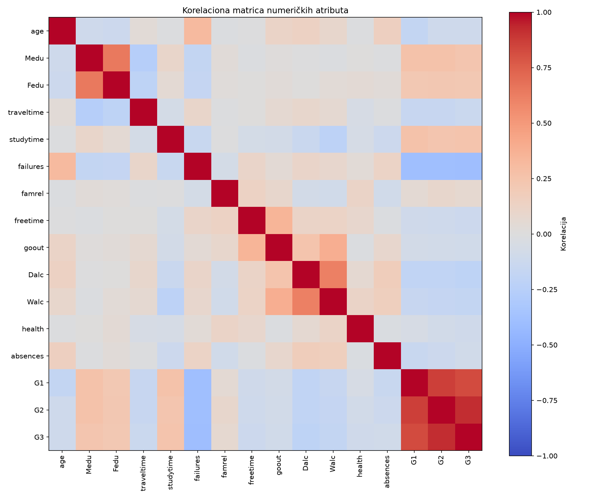

Odnos prethodnih ocena i završne ocene dodatno potvrđuje jaku linearnu vezu. Korelacija između `G1` i `G3` iznosi 0.83, dok korelacija između `G2` i `G3` iznosi 0.92. To znači da učenici sa boljim prethodnim ocenama najčešće imaju i bolju završnu ocenu.

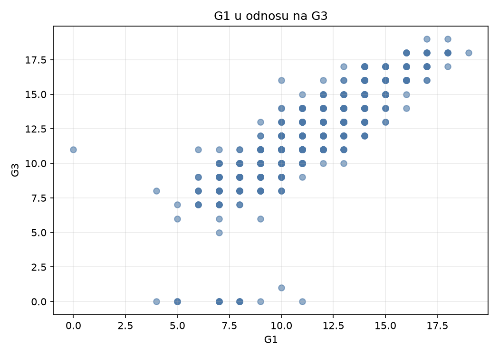

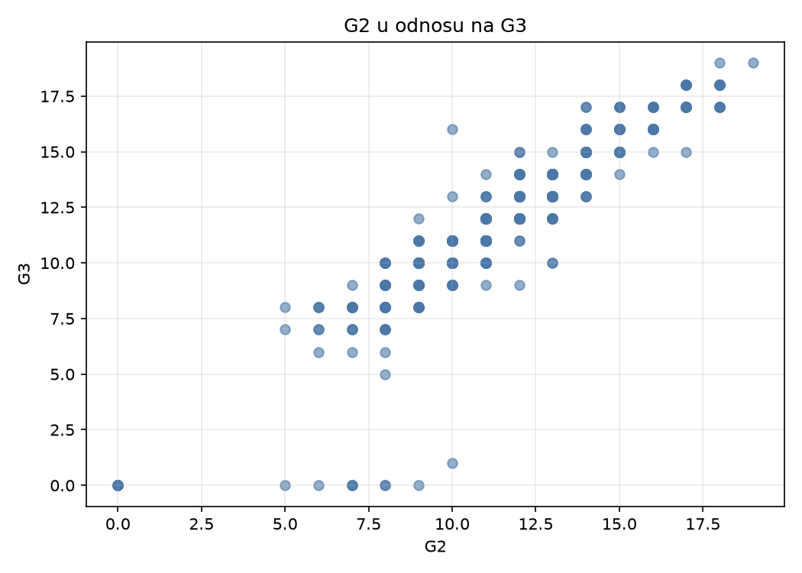

Ostali atributi imaju slabiju, ali korisnu vezu sa završnom ocenom. Broj prethodnih neuspeha (`failures`) ima negativnu korelaciju sa `G3`, što znači da veći broj prethodnih neuspeha uglavnom prati niža završna ocena. Atribut `studytime` pokazuje pozitivnu korelaciju, ali znatno slabiju od `G1` i `G2`, što znači da veće vreme učenja jeste povezano sa boljom ocenom, ali ta veza nije dominantna.

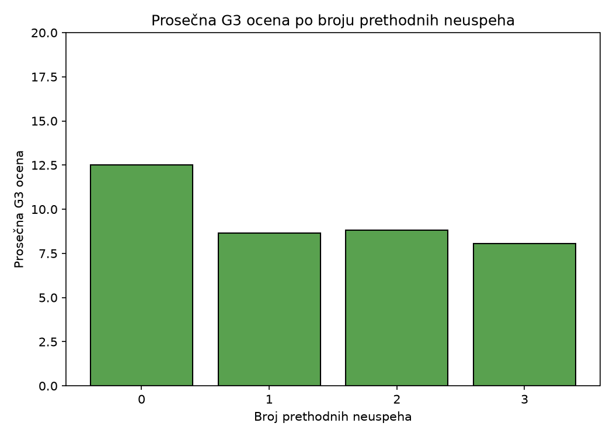

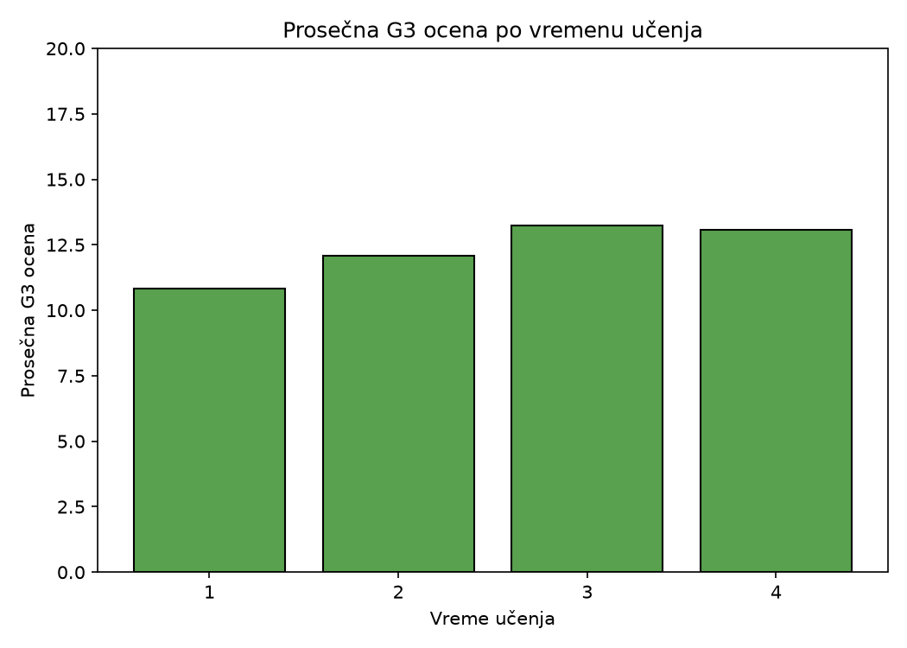

Broj izostanaka (`absences`) ima slabu negativnu korelaciju sa završnom ocenom. To znači da veći broj izostanaka u proseku može biti povezan sa nižom ocenom, ali veza nije jaka i ne objašnjava sama po sebi završni uspeh učenika. Distribucija izostanaka je ipak važna za razumevanje ekstremnijih slučajeva:

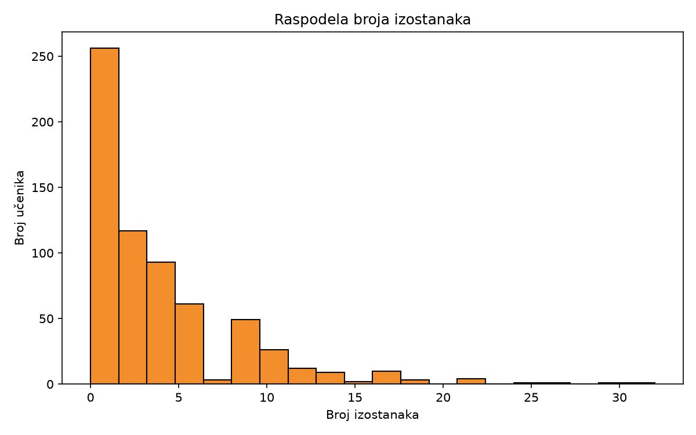

Vrednosti poput `G3 = 0` i većeg broja izostanaka nisu automatski obrisane, jer mogu predstavljati realne slučajeve u obrazovnom kontekstu. EDA zbog toga nije korišćena za filtriranje podataka, već za bolje razumevanje odnosa između atributa i za opravdanje kasnijeg poređenja scenarija sa i bez `G1/G2`.

Zaključak EDA faze je da prethodne ocene `G1` i `G2` imaju ubedljivo najjaču vezu sa završnom ocenom `G3`, zbog čega se očekuje da modeli koji koriste ove atribute ostvare znatno bolje performanse. Ostali atributi pojedinačno pokazuju znatno slabije korelacije sa `G3`, što znači da nijedan od njih samostalno ne objašnjava dovoljno dobro završnu ocenu. Ipak, oni mogu imati korisnu vrednost u kombinaciji sa drugim atributima, posebno u scenariju bez `G1/G2`, gde model mora da koristi slabije indirektne signale kao što su prethodni neuspesi, vreme učenja, izostanci i porodično-školski faktori.

## 5. Dodatna analiza ekstremnih i retkih vrednosti

Pored osnovne provere opsega, urađena je dodatna analiza ekstremnih i retkih vrednosti u koraku `step02b_anomaly_analysis.py`. Cilj ovog koraka je bolje razumevanje vrednosti koje statistički odskaču ili se retko pojavljuju, a ne filtriranje podataka ili menjanje toka treniranja modela.

Za numeričke atribute koristi se IQR metoda. Ona se zasniva na kvartilima, odnosno vrednostima koje dele sortirane podatke na delove. Donji kvartil `Q1` predstavlja vrednost ispod koje se nalazi približno 25% podataka, dok gornji kvartil `Q3` predstavlja vrednost ispod koje se nalazi približno 75% podataka. Razlika između `Q3` i `Q1` naziva se interkvartilni raspon, odnosno IQR, i pokazuje raspon srednjih 50% vrednosti u posmatranoj koloni.

IQR metoda koristi sledeće formule:

```text
IQR = Q3 - Q1
donja granica = Q1 - 1.5 * IQR
gornja granica = Q3 + 1.5 * IQR

Faktor 1.5 je standardno pravilo u IQR metodi i koristi se za određivanje granica izvan kojih se vrednosti smatraju potencijalno ekstremnim. On predstavlja kompromis: dovoljno je širok da ne označi previše normalnih vrednosti kao outlier-e, ali dovoljno osetljiv da izdvoji vrednosti koje značajno odskaču od srednjeg dela raspodele.
```

Vrednosti ispod donje granice ili iznad gornje granice označavaju se kao potencijalni outlier-i. To znači da statistički odskaču od većine vrednosti u koloni, ali ne znači automatski da su greške u podacima. Na primer, veći broj izostanaka, niska završna ocena ili veći broj prethodnih neuspeha mogu predstavljati realne učenike, a ne pogrešno unete podatke.

Za kategorijske atribute ne koristi se IQR, jer njihove vrednosti nisu numeričke i nemaju prirodan redosled za računanje kvartila. Umesto toga proverava se broj jedinstvenih vrednosti po atributu i da li postoje kategorije koje se pojavljuju retko. Kategorija se smatra retkom ako se pojavljuje najviše 5 puta.

Izveštaji ovog koraka nalaze se u:

- `data/logs/step02b_anomaly_analysis/anomaly_summary.csv`;
- `data/logs/step02b_anomaly_analysis/iqr_outlier_report.csv`;
- `data/logs/step02b_anomaly_analysis/categorical_value_report.csv`.

Fajl `iqr_outlier_report.csv` sadrži red za svaki numerički atribut i kolone `Q1`, `Q3`, `IQR`, `lower_bound`, `upper_bound`, `below_lower_count`, `above_upper_count` i `total_potential_outliers`. Na taj način se za svaku numeričku kolonu vidi kako su izračunate IQR granice i koliko vrednosti se nalazi ispod ili iznad tih granica.

Sažetak dodatne analize:

| Pokazatelj | Vrednost |
| --- | ---: |
| IQR analiza numeričkih atributa | 16 atributa |
| Atributi kod kojih IQR pronalazi ekstremne vrednosti | 11 od 16 |
| Ukupan broj potencijalnih IQR outlier vrednosti | 360 |
| Broj redova označenih kao IQR ekstrem za `absences` ili `G3` | 37 |
| Broj učenika sa `G3 = 0` | 15 |
| Maksimalan broj izostanaka | 32 |
| Prag za retke kategorije | 5 |

CSV analiza IQR outlier-a urađena je nad svih 16 numeričkih atributa. Grafik `numeric_boxplots.png` radi preglednosti prikazuje izabrane najvažnije numeričke atribute: `G1`, `G2`, `G3`, `absences`, `failures` i `age`. Ovi atributi su izdvojeni zato što su najlakši za tumačenje u kontekstu uspeha učenika: ocene direktno opisuju školski uspeh, `absences` prikazuje izostanke, `failures` prethodne neuspehe, a `age` osnovnu demografsku karakteristiku.

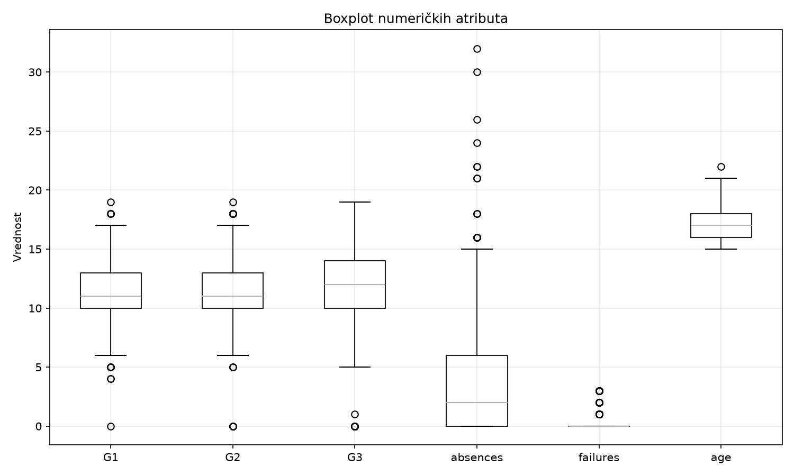

Grafik `absences_vs_g3_outliers.png` tumači odnos izostanaka i završne ocene. Izabrani su baš `absences` i `G3` zato što je `G3` ciljna promenljiva koju model predviđa, dok je `absences` jedan od najrazumljivijih numeričkih atributa kod kog se pojavljuju ekstremne vrednosti. Veliki broj izostanaka je realno moguć u obrazovnom kontekstu i može biti povezan sa uspehom učenika, pa je korisno posebno proveriti kako se takvi slučajevi ponašaju u odnosu na završnu ocenu.

Zato su kao IQR ekstremi označeni samo redovi koji su ekstremni po `absences` ili `G3`, a ne redovi koji odskaču u bilo kojoj od ostalih numeričkih kolona. Cilj ovog grafika nije prikaz svih IQR outlier-a iz celog dataset-a, već dodatno tumačenje odnosa između ekstremnog broja izostanaka i završne ocene.

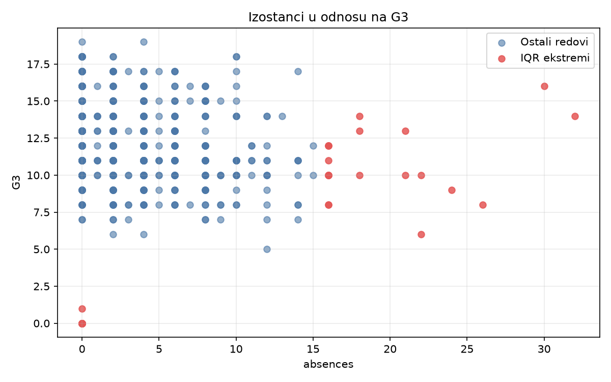

Grafik `categorical_unique_counts.png` prikazuje broj jedinstvenih vrednosti po kategorijskom atributu. Ova provera je korisna zato što kod kategorijskih atributa ekstremnost ne može da se posmatra preko numeričkih granica kao kod IQR metode. Umesto toga, proverava se da li atributi imaju očekivan broj kategorija i da li se neke kategorije pojavljuju veoma retko.

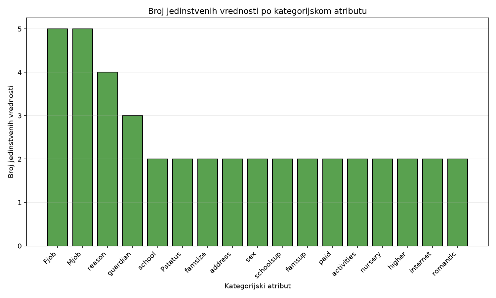

Ukupan broj potencijalnih IQR outlier vrednosti nije isto što i broj redova, jer jedan red može biti ekstreman u više numeričkih kolona. Na primer, isti učenik može istovremeno imati veliki broj izostanaka i veoma nisku završnu ocenu, pa se u zbiru potencijalnih outlier vrednosti računa više puta.

Ekstremne numeričke vrednosti i retke kategorije nisu automatski greške. One mogu predstavljati realne učenike i realne situacije u dataset-u, kao što su učenici sa mnogo izostanaka, veoma niskom ocenom ili prethodnim neuspesima. Zbog toga redovi nisu uklonjeni. Ova analiza služi za proveru i bolje razumevanje podataka, a ne za filtriranje redova ili menjanje finalnog modela.

## 6. Podela podataka

Dataset je jednom podeljen na trening, validacioni i test skup.Izveštaj se nalazi u `data/logs/step03_data_split/split_report.csv`.

Podela podataka je važna zato što model ne treba ocenjivati samo na podacima na kojima je učio. Ako bi se model trenirao i proveravao na istim podacima, rezultat bi mogao biti previše optimističan, jer bi model mogao dobro da zapamti trening primere, a da lošije radi na novim podacima.

U projektu su korišćena tri skupa:

- trening skup: koristi se za učenje parametara modela;
- validacioni skup: koristi se za poređenje modela i izbor hiperparametara;
- test skup: koristi se za finalnu proveru performansi na podacima koji nisu korišćeni ni za treniranje ni za izbor modela;

| Skup | Broj redova | Procenat |
| --- | ---: | ---: |
| Train | 454 | 69.95% |
| Validation | 97 | 14.95% |
| Test | 98 | 15.10% |

Svi modeli i svi scenariji koriste iste redove iz ove podele. Time je poređenje modela fer i ponovljivo, jer razlike u rezultatima dolaze od modela i atributa, a ne od drugačije podele podataka.

Test skup se ne koristi za podešavanje hiperparametara niti za izbor najboljeg modela tokom treniranja. On se čuva za finalnu proveru, kako bi se dobila realnija procena ponašanja modela na novim, neviđenim podacima. Ovakav postupak smanjuje rizik od overfitting-a prema validacionom skupu.

## 7. Odabir i treniranje modela

Pošto je cilj projekta predikcija završne ocene `G3`, problem je regresionog tipa. Zbog toga su korišćeni regresioni modeli, odnosno modeli koji kao izlaz daju numeričku vrednost, a ne klasu. Model treba da predvidi ocenu na skali od 0 do 20.

U početnom poređenju trenirana su tri modela:

- `DummyRegressor`: jednostavan baseline model;
- `Ridge Regression`: linearni regresioni model sa regularizacijom;
- `RandomForestRegressor`: nelinearni ansambl model zasnovan na stablima odlučivanja.

Ovi modeli su izabrani zato što zajedno pokrivaju tri važna nivoa poređenja: najjednostavniji referentni model, linearni model i složeniji nelinearni model. Time se može proveriti da li problem može dobro da se reši jednostavnim linearnim pristupom ili je potreban složeniji model koji hvata nelinearne odnose između atributa.

`DummyRegressor` je korišćen kao baseline model. On ne uči stvarne odnose između atributa i ciljne promenljive, već daje jednostavnu referentnu predikciju, najčešće prosečnu vrednost ciljne promenljive iz trening skupa. Njegova uloga je da pokaže minimalni nivo performansi koji ostali modeli treba da nadmaše. 

`Ridge Regression` je izabran kao linearni model. Linearni modeli pretpostavljaju da se ciljna promenljiva može opisati kao linearna kombinacija ulaznih atributa. Osnovna ideja linearne regresije može se zapisati kao:

```text
y_pred = b0 + b1*x1 + b2*x2 + ... + bn*xn

gde je : 
y_pred - predviđena vrednost
x1, x2, ..., xn - ulazni atributi
b0 - slobodni član (bias) 
b1, b2, ..., bn - koeficijenti(tezine) koje model uči.
```

Ridge Regression dodaje regularizaciju, odnosno dodatno kažnjavanje prevelikih koeficijenata. Time se smanjuje rizik od preteranog prilagođavanja trening podacima. Regularizacija je posebno korisna kada postoji veći broj ulaznih atributa nakon `OneHotEncoder` transformacije, jer se kategorijski atributi pretvaraju u više binarnih kolona. Parametar `alpha` kontroliše jačinu regularizacije: veća vrednost `alpha` znači jače kažnjavanje velikih koeficijenata.

`RandomForestRegressor` je izabran kao nelinearni model. On se sastoji od većeg broja stabala odlučivanja, pri čemu svako stablo daje svoju predikciju, a konačna predikcija se dobija prosekom predikcija svih stabala. Ovaj pristup može da uhvati složenije i nelinearne odnose između atributa, kao i interakcije između više atributa. Na primer, uticaj izostanaka može zavisiti od prethodnih ocena, vremena učenja ili broja prethodnih neuspeha.

Svi modeli su trenirani u oba glavna scenarija:

- `with_G1_G2`: ulazni atributi uključuju prethodne ocene `G1` i `G2`;
- `without_G1_G2`: iz ulaznih atributa su uklonjeni `G1` i `G2`.

Složeniji modeli bi potencijalno mogli da ostvare nešto bolje rezultate, posebno u scenariju `without_G1_G2`, jer mogu da uhvate nelinearne odnose i interakcije između atributa. Ipak, ne očekuje se da bi oni potpuno nadoknadili nedostatak prethodnih ocena `G1` i `G2`, zato što EDA pokazuje da ostali atributi imaju znatno slabiju vezu sa završnom ocenom `G3`.

Zbog toga problem u scenariju bez `G1/G2` nije samo izbor algoritma, već i količina korisnih informacija dostupnih u ulaznim atributima. Kada se uklone atributi koji nose najjači signal, model se oslanja na slabije indirektne pokazatelje kao što su `failures`, `studytime`, `absences`, `higher`, `school`, `reason` i drugi faktori.

Modeli kao što su neuronske mreže, KNN, SVM ili boosting metode mogli bi biti predmet dodatnog ispitivanja, ali nisu bili glavni fokus ovog projekta. Dataset je relativno mali i tabelaran, a važna je i interpretabilnost rezultata. Kod malog dataset-a previše složeni modeli mogu povećati rizik od overfitting-a, odnosno dobrog prilagođavanja trening podacima, ali slabijeg ponašanja na novim podacima.

Korišćene su tri metrike za evaluaciju regresionih modela:

- `MAE`;
- `RMSE`;
- `R2`.

MAE, odnosno Mean Absolute Error, predstavlja prosečnu apsolutnu grešku modela. Računa se kao prosečna apsolutna razlika između stvarne i predviđene vrednosti:

```text
MAE = (1/n) * Σ |y_i - y_pred_i|
gde je :
y_i - stvarna vrednost
y_pred_i - predviđena vrednost
n - broj primera.
```

 MAE je lako tumačiti jer je izražen u istoj jedinici kao ciljna promenljiva. MAE nam pokazuje za koliko ocena model prosečno greši.

RMSE, odnosno Root Mean Squared Error, predstavlja koren srednje kvadratne greške:

```text
RMSE = sqrt((1/n) * Σ (y_i - y_pred_i)^2)
```

RMSE takođe meri grešku u jedinicama ciljne promenljive, ali jače kažnjava veće greške zato što se razlike kvadriraju. Zbog toga je RMSE koristan kada su velike greške posebno nepoželjne. Veći RMSE može da ukaže na to da model kod nekih učenika pravi znatno veće promašaje u predikciji završne ocene.

R2, odnosno koeficijent determinacije, pokazuje koliki deo varijanse ciljne promenljive (mera rasipanja stvarnih `G3` oko njihove prosečne vrednosti) model uspeva da objasni:

```text
R2 = 1 - Σ(y_i - y_pred_i)^2 / Σ(y_i - y_mean)^2
gde je :
y_mean - prosečna vrednost stvarnih ocena. 
```

Vrednost R2 bliža 1 znači da model dobro objašnjava varijaciju u podacima. Vrednost oko 0 znači da model nije bolji od predikcije prosečne vrednosti, dok negativna vrednost znači da je model lošiji od takvog jednostavnog pristupa.

Za MAE i RMSE manje vrednosti su bolje. Za R2 veće vrednosti su bolje. MAE i RMSE su posebno korisni jer se direktno tumače kroz grešku u ocenama, dok R2 pokazuje koliko model ukupno dobro objašnjava završnu ocenu učenika.

Sažetak iz `data/logs/step04_model_training/model_comparison_report.csv`:

| Scenario | Model | Validation RMSE | Validation R2 | Test RMSE | Test R2 |
| --- | --- | ---: | ---: | ---: | ---: |
| with_G1_G2 | DummyRegressor | 3.1360 | -0.0004 | 3.5229 | -0.0291 |
| with_G1_G2 | Ridge Regression | 1.0555 | 0.8867 | 1.3314 | 0.8530 |
| with_G1_G2 | RandomForestRegressor | 0.9862 | 0.9011 | 1.3905 | 0.8397 |
| without_G1_G2 | DummyRegressor | 3.1360 | -0.0004 | 3.5229 | -0.0291 |
| without_G1_G2 | Ridge Regression | 2.8668 | 0.1639 | 3.0243 | 0.2416 |
| without_G1_G2 | RandomForestRegressor | 2.7779 | 0.2150 | 2.9105 | 0.2976 |

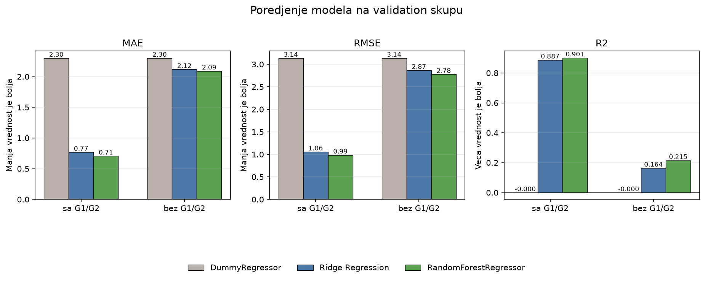

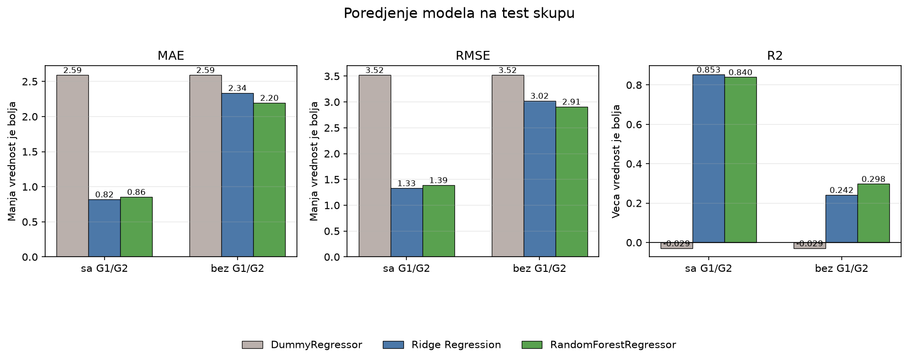

Rezultati pokazuju da modeli sa `G1` i `G2` ostvaruju znatno bolje performanse od modela bez ovih atributa. To je očekivano, jer su prethodne ocene direktno povezane sa završnom ocenom. U EDA fazi je pokazano da je korelacija između `G2` i `G3` 0.92, a između `G1` i `G3` 0.83.

U scenariju `with_G1_G2`, `Ridge Regression` i `RandomForestRegressor` imaju mnogo bolje rezultate od `DummyRegressor` modela. To znači da oba modela uče koristan signal iz podataka. `RandomForestRegressor` ima nešto bolji rezultat na validacionom skupu, dok `Ridge Regression` na testu. U ovoj fazi validacioni skup se koristi za poređenje modela i kasnije podešavanje hiperparametara. Test skup se ne koristi za izbor modela u ovoj fazi, već samo pokazuje kako se modeli ponašaju na neviđenim podacima.

U scenariju `without_G1_G2`, performanse su znatno slabije. To znači da ostali atributi pojedinačno i zajedno nose slabiji signal o završnoj oceni. Ipak, i u ovom scenariju Ridge Regression i Random Forest nadmašuju `DummyRegressor`, što znači da atributi kao što su `failures`, `studytime`, `absences`, `higher`, `school`, `reason` i drugi ipak sadrže određene korisne informacije ali ne dovoljne da dobijemo podjednako jake rezultate kao u scenariju `with_G1_G2`.

Zaključak ovog koraka je da prethodne ocene `G1` i `G2` imaju presudan uticaj na kvalitet predikcije završne ocene. Modeli sa ovim atributima su znatno precizniji i praktično upotrebljiviji kada su prethodne ocene dostupne. Modeli bez `G1/G2` su slabiji, ali mogu biti korisni za raniju procenu rizika, kada još ne postoje prethodne periodične ocene.

## 8. Podešavanje hiperparametara

Podešavanje hiperparametara sprovedeno je u koraku `step06_hyperparameter_tuning.py`, pomoću validacionog skupa. Hiperparametri su podešavanja modela koja nisu direktno naučena iz podataka, već se unapred zadaju (bira ih korisnik ili postupak pretrage) i utiču na način na koji model uči.

Hiperparametri su podešavani za modele `Ridge Regression` i `RandomForestRegressor`. `DummyRegressor` nije podešavan, jer služi samo kao jednostavan baseline model i nema smisao optimizovati ga kao glavni prediktivni model.

Za podešavanje je korišćen ručni grid search. To znači da je unapred definisana mala mreža mogućih vrednosti hiperparametara. Zatim se za svaku kombinaciju hiperparametara trenira model na trening skupu i proverava njegov rezultat na validacionom skupu. Kombinacija koja ostvari najbolji validacioni rezultat bira se kao najbolja za taj model i scenario.

Postupak ručnog grid search-a može se opisati kroz sledeće korake:

1. Definišu se kandidati za hiperparametre.
2. Za svaku kombinaciju kandidata kreira se model.
3. Model se trenira na trening skupu.
4. Model se evaluira na validacionom skupu.
5. Čuva se kombinacija koja daje najbolji validacioni rezultat.
6. Test skup se koristi tek nakon izbora, kao provera ponašanja modela na neviđenim podacima.

Kandidati za hiperparametre nisu birani tako da se iscrpno pretraži veliki broj mogućnosti, već kao mala i pregledna mreža vrednosti. Cilj je bio da se isprobaju reprezentativne vrednosti koje pokrivaju jednostavnije i složenije varijante modela, a da se pritom ne poveća nepotrebno vreme treniranja i rizik od preteranog prilagođavanja validacionom skupu.

Kod `Ridge Regression` modela podešavan je hiperparametar `alpha`. Isprobane su sledeće vrednosti:

```text
alpha = 0.01, 0.1, 1.0, 10.0, 100.0
```

`alpha` određuje jačinu regularizacije. Regularizacija je dodatno kažnjavanje prevelikih koeficijenata modela. Kada je `alpha` veći, model više kažnjava velike koeficijente, pa postaje jednostavniji i manje sklon overfitting-u. Kada je `alpha` manji, regularizacija je slabija i model može više da se prilagodi trening podacima.

Manje vrednosti `alpha`, kao što su `0.01` i `0.1`, predstavljaju slabiju regularizaciju. Vrednost `1.0` predstavlja srednji nivo regularizacije. Veće vrednosti, kao što su `10.0` i `100.0`, jače kažnjavaju velike koeficijente i čine model jednostavnijim. Na taj način proverava se da li model bolje radi sa slabijom ili jačom regularizacijom.

Osnovna ideja Ridge regularizacije je da model ne minimizuje samo grešku predikcije, već i veličinu koeficijenata:

```text
Ridge cilj = greška modela + alpha * suma kvadrata koeficijenata
```

Zbog toga `alpha` kontroliše kompromis između dobrog uklapanja u trening podatke i jednostavnosti modela. Premali `alpha` može dovesti do prevelikog prilagođavanja trening podacima, dok preveliki `alpha` može previše pojednostaviti model i pogoršati predikcije.

Kod `RandomForestRegressor` modela podešavani su hiperparametri `n_estimators`, `max_depth` i `min_samples_leaf`. Isprobane su sledeće vrednosti:

```text
n_estimators = 100, 200
max_depth = None, 5, 10
min_samples_leaf = 1, 2, 5
```

`n_estimators` predstavlja broj stabala odlučivanja u šumi. Veći broj stabala obično daje stabilnije predikcije, jer se konačna predikcija dobija prosekom više stabala. Isprobane su vrednosti `100` i `200`, kako bi se proverilo da li veći broj stabala donosi bolji i stabilniji rezultat. Međutim, veći broj stabala povećava vreme treniranja i ne mora uvek značajno poboljšati performanse.

`max_depth` predstavlja maksimalnu dubinu pojedinačnog stabla. Vrednost `5` predstavlja pliće i jednostavnije stablo, vrednost `10` dozvoljava složeniji model, dok `None` znači da dubina stabla nije unapred ograničena. Dublje stablo može naučiti složenije odnose u podacima, ali može i previše da se prilagodi trening skupu. Manja dubina ograničava složenost stabla i može pomoći u smanjenju overfitting-a.

`min_samples_leaf` predstavlja minimalan broj primera koji mora postojati u završnom čvoru stabla, odnosno listu. Vrednost `1` dozvoljava veoma specifične podele, vrednost `2` uvodi blago ograničenje, dok vrednost `5` zahteva da svaki list sadrži više primera. Ako je ova vrednost veća, stablo ne može praviti previše specifične podele na veoma malom broju učenika. Time se model čini stabilnijim i manje sklonim overfitting-u.

Ovi hiperparametri su važni zato što kontrolišu složenost Random Forest modela. Ako je model previše složen, može veoma dobro raditi na trening skupu, ali slabije na novim podacima. Ako je model previše jednostavan, možda neće uhvatiti korisne obrasce u podacima.

Ručni grid search trenira model za svaku kombinaciju navedenih vrednosti i poredi rezultate na validacionom skupu. Najbolja kombinacija se bira prema najnižoj vrednosti `validation_RMSE`. Test skup se ne koristi za izbor hiperparametara, već se koristi tek nakon izbora najbolje kombinacije, kao provera ponašanja modela na neviđenim podacima. Ako bi se hiperparametri birali na osnovu test rezultata, test skup više ne bi predstavljao objektivnu procenu generalizacije modela.

Sažetak iz `data/logs/step06_hyperparameter_tuning/hyperparameter_tuning_summary.csv`:

| Scenario | Model | Najbolji parametri | Validation RMSE | Test RMSE | Test R2 |
| --- | --- | --- | ---: | ---: | ---: |
| with_G1_G2 | Ridge Regression | `alpha=10.0` | 1.0457 | 1.3370 | 0.8518 |
| with_G1_G2 | RandomForestRegressor | `n_estimators=100; max_depth=5; min_samples_leaf=5` | 0.8831 | 1.4138 | 0.8343 |
| without_G1_G2 | Ridge Regression | `alpha=100.0` | 2.7782 | 2.9202 | 0.2929 |
| without_G1_G2 | RandomForestRegressor | `n_estimators=100; max_depth=10; min_samples_leaf=2` | 2.7633 | 2.9108 | 0.2974 |

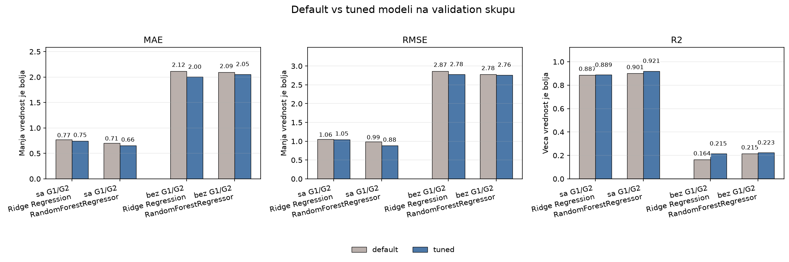

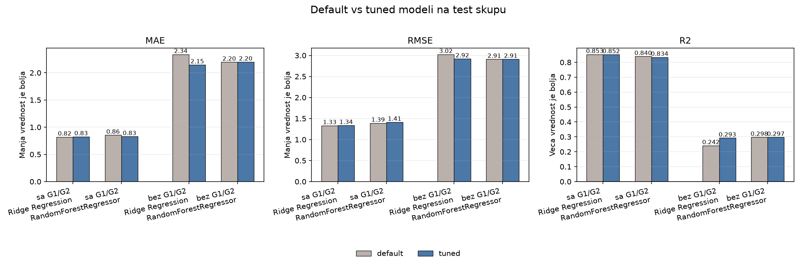

Rezultati pokazuju da podešavanje hiperparametara može poboljšati performanse modela, posebno na validacionom skupu. U scenariju `with_G1_G2`, `RandomForestRegressor` nakon podešavanja ima bolji validacioni RMSE nego u početnom modelu. Validacioni RMSE pada sa 0.9862 na 0.8831, što znači da podešeni hiperparametri bolje odgovaraju validacionom skupu.

Kod `Ridge Regression` modela promene su manje, ali model ostaje stabilan i interpretabilan. U scenariju bez `G1/G2`, tuning donosi ograničeno poboljšanje, što je očekivano jer ostali atributi nose slabiji signal o završnoj oceni. Podešavanje hiperparametara može poboljšati način na koji model koristi dostupne informacije, ali ne može potpuno nadoknaditi nedostatak jakih atributa kao što su `G1` i `G2`.

Na osnovu ovog koraka vidi se da tuning može poboljšati rezultate, ali izbor finalnog modela treba posmatrati zajedno sa kasnijim koracima: analizom značajnosti atributa, top features scenarijem i finalnom proverom modela.

## 9. Analiza značajnosti atributa

Analiza značajnosti atributa urađena je u koraku `step08_feature_importance.py`. Cilj ovog koraka je da se proveri na koje ulazne atribute se model najviše oslanja pri predikciji završne ocene `G3`.

Za procenu značajnosti atributa korišćen je `RandomForestRegressor`. Ovaj model je pogodan za feature importance analizu zato što je zasnovan na velikom broju stabala odlučivanja. Svako stablo tokom treniranja pravi podele podataka na osnovu atributa koji najbolje smanjuju grešku predikcije. Ako se neki atribut često koristi u važnim podelama i ako te podele značajno poboljšavaju predikciju, taj atribut dobija veći značaj.

Pošto svako stablo može koristiti različite atribute i različite podele, Random Forest može da proceni koji atributi najviše doprinose ukupnoj predikciji modela.

Veća vrednost feature importance-a znači da je atribut imao veći doprinos u donošenju predikcija. Zbir značajnosti svih atributa je jednak 1, odnosno 100% ukupnog značaja raspodeljuje se između atributa.

Važno je naglasiti da feature importance ne znači nužno uzročno-posledičnu vezu. Ako atribut ima veliki značaj, to znači da ga je model često koristio za predikciju, ali ne znači automatski da taj atribut samostalno uzrokuje bolju ili lošiju ocenu. Na primer, `G2` je veoma važan atribut jer je jako povezan sa `G3`, ali to ne znači da je jedini faktor koji utiče na završnu ocenu.

Rezultati feature importance analize nalaze se u:

- `data/logs/step08_feature_importance/feature_importance_with_G1_G2.csv`;
- `data/logs/step08_feature_importance/feature_importance_without_G1_G2.csv`.

U scenariju sa `G1/G2`, najvažniji atribut je `G2`, sa značajem 0.896595. To znači da se Random Forest model u ovom scenariju dominantno oslanja na drugu periodičnu ocenu pri predikciji završne ocene. Ovakav rezultat je očekivan, jer je u EDA fazi pokazano da `G2` ima veoma jaku korelaciju sa `G3`.

Nakon `G2`, među značajnijim atributima pojavljuju se `absences`, `G1`, `age` i `reason`. Ipak, njihov značaj je znatno manji u odnosu na `G2`. To pokazuje da, kada su prethodne ocene dostupne, model najviše koristi direktne informacije o ranijem uspehu učenika, dok ostali atributi imaju pomoćnu ulogu.

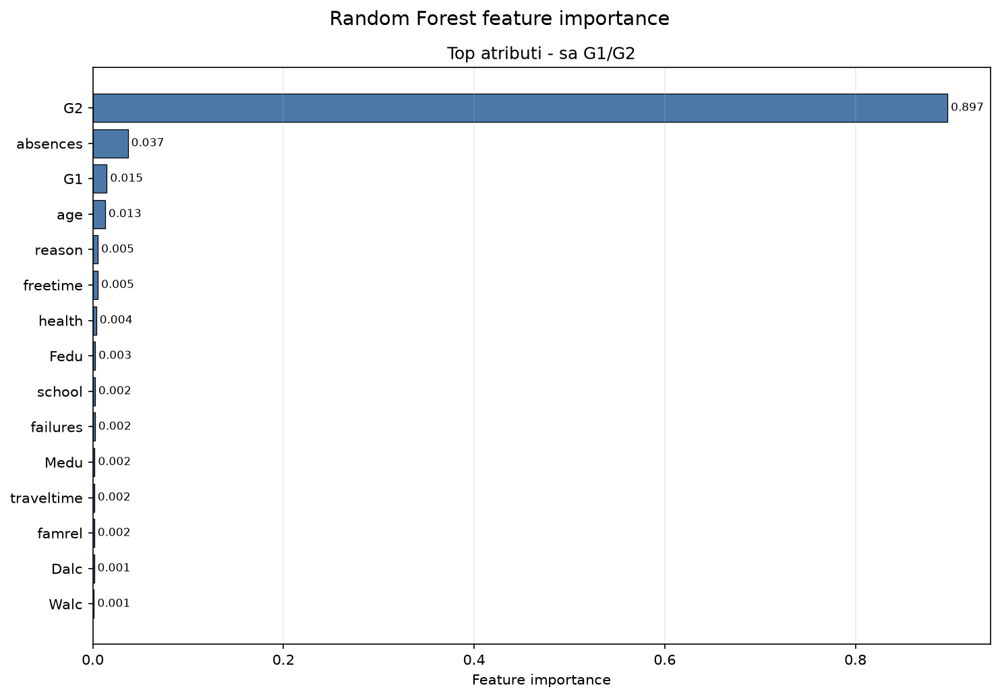

U scenariju bez `G1/G2`, model više nema pristup prethodnim ocenama, pa se oslanja na druge osobine učenika. Najvažniji atribut je `failures`, zatim `reason`, `absences`, `school`, `higher`, `age`, `Fedu`, `health`, `Dalc` i `studytime`.

Ovakav raspored atributa ima smisla. Atribut `failures` označava broj prethodnih neuspeha i prirodno je povezan sa slabijim školskim uspehom. `absences` može ukazivati na probleme sa prisustvom nastavi. `studytime` opisuje vreme učenja, dok atributi kao što su `higher`, `school`, `reason`, `Fedu` i `health` mogu indirektno opisivati obrazovne namere, školsko okruženje, porodični kontekst i opšte uslove učenika.

Promena liste najvažnijih atributa između dva scenarija je očekivana. Kada su `G1` i `G2` dostupni, oni preuzimaju najveći deo značaja, posebno `G2`, jer direktno opisuju prethodni školski uspeh učenika. Zbog toga ostali atributi, iako mogu biti korisni, imaju znatno manji relativni značaj. Na primer, `age`, `absences` ili `reason` mogu pomoći modelu, ali njihov doprinos izgleda manji zato što model već ima veoma jak signal kroz prethodne ocene.

Kada se `G1` i `G2` uklone, model više nema direktnu informaciju o prethodnom uspehu učenika. Tada se značaj preraspodeljuje na druge atribute koji mogu indirektno ukazivati na uspeh ili rizik. Zbog toga `failures` postaje najvažniji atribut, jer broj prethodnih neuspeha direktnije ukazuje na probleme u školskom uspehu. Atributi kao što su `reason`, `school`, `higher`, `Fedu`, `health`, `Dalc` i `studytime` dobijaju veći relativni značaj jer model pokušava da iz dostupnih, slabijih signala nadoknadi nedostatak prethodnih ocena.

Zbog ovoga se neki atributi pomeraju na listi ili ispadaju iz top 10. Na primer, `age` može imati određeni značaj kada su `G1` i `G2` prisutni, ali u scenariju bez prethodnih ocena drugi atributi postaju korisniji za model. Slično tome, `absences` ostaje važan u oba scenarija, ali njegov relativni položaj može da se promeni jer se promenio ceo skup informacija koje model ima na raspolaganju. Feature importance je relativna mera, pa se značaj jednog atributa uvek tumači u odnosu na ostale atribute koji su dostupni u tom scenariju.

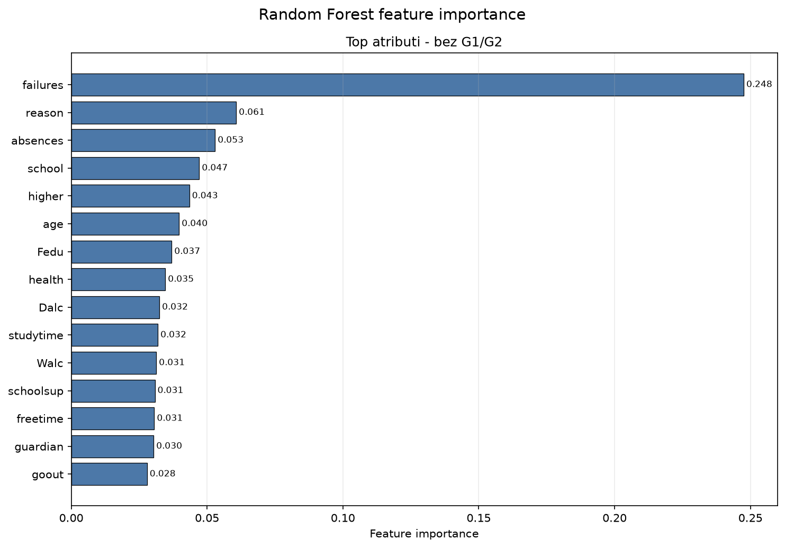

Za `Ridge Regression` nije posebno računata feature importance lista na isti način kao za Random Forest. Razlog je to što Ridge Regression daje koeficijente za transformisane ulazne kolone, a ne za originalne atribute u jednostavnom obliku. Nakon `OneHotEncoder` transformacije, jedan kategorijski atribut može biti pretvoren u više binarnih kolona, pa direktno poređenje koeficijenata nije uvek jednostavno za tumačenje.

Zbog toga je Random Forest korišćen kao glavni model za procenu značajnosti atributa. Atributi koje je Random Forest izdvojio kao najvažnije kasnije su korišćeni za formiranje `top features` scenarija. U tom sledećem koraku proverava se kako se različiti modeli, uključujući i `Ridge Regression`, ponašaju kada koriste samo najznačajnije atribute. Dakle, Ridge Regression ne računa sam listu najvažnijih atributa u ovoj fazi, već se testira nad skupom atributa koji je prethodno izdvojen na osnovu Random Forest feature importance analize.

Zaključak ove analize je da se značaj atributa veoma razlikuje između dva scenarija. Kada su `G1` i `G2` dostupni, model se dominantno oslanja na `G2`, što potvrđuje da prethodne ocene nose najveći deo korisne informacije za predikciju završne ocene. Kada se `G1` i `G2` uklone, model mora da koristi slabije i indirektnije pokazatelje uspeha, kao što su prethodni neuspesi, izostanci, vreme učenja i obrazovni kontekst učenika.

Ova analiza dodatno objašnjava zašto su performanse modela znatno bolje u scenariju sa `G1/G2`, a slabije u scenariju bez njih. Takođe predstavlja osnovu za sledeći korak, gde se proverava da li modeli mogu da zadrže dobre performanse kada se koriste samo najznačajniji atributi.

## 10. Top features scenario

Nakon analize značajnosti atributa provereno je da li modeli mogu da zadrže dobre performanse kada koriste samo najvažnije atribute. Ovaj korak se naziva `top features` scenario.

Ideja nije samo da se smanji broj atributa, već da se proveri da li se uklanjanjem manje značajnih atributa dobija jednostavniji, stabilniji i lakše objašnjiv model. Ako model sa manjim brojem atributa daje slične ili bolje rezultate od modela sa svim atributima, to znači da deo atributa ne doprinosi značajno kvalitetu predikcije ili čak može unositi nepotreban šum.

Najvažniji atributi izabrani su na osnovu feature importance analize iz prethodnog koraka. Formirana su dva nova scenarija:

- `top_features_with_G1_G2`: koristi 10 najvažnijih atributa iz scenarija sa `G1/G2`;
- `top_features_without_G1_G2`: koristi 10 najvažnijih atributa iz scenarija bez `G1/G2`.

Top 10 atributa u scenariju sa `G1/G2` su:

```text
G2, absences, G1, age, reason, freetime, health, Fedu, school, failures
```

Top 10 atributa u scenariju bez `G1/G2` su:

```text
failures, reason, absences, school, higher, age, Fedu, health, Dalc, studytime
```

Važno je naglasiti da top features scenario ne znači da su ostali atributi potpuno beskorisni. On samo proverava da li se dovoljno dobar model može napraviti korišćenjem manjeg broja atributa koje je Random Forest označio kao najznačajnije.

U ovom koraku ponovo su trenirani `Ridge Regression` i `RandomForestRegressor`, ali sada nad smanjenim skupom atributa. Proverene su i verzije modela sa početnim, default hiperparametrima, kao i verzije sa podešenim hiperparametrima iz grid search koraka. Na taj način se poredi ne samo uticaj smanjenja broja atributa, već i uticaj podešavanja hiperparametara na modele koji koriste samo najvažnije atribute.

Performanse top features modela zatim su upoređene sa modelima koji koriste sve atribute. Time se proverava da li manji broj pažljivo izabranih atributa može da da isti ili bolji rezultat od kompletnog skupa atributa.

Sažetak poređenja:

| Scenario | Model | Validation RMSE | Test RMSE | Test R2 |
| --- | --- | ---: | ---: | ---: |
| with_G1_G2 | Ridge Regression | 1.0457 | 1.3370 | 0.8518 |
| top_features_with_G1_G2 | Ridge Regression | 0.9735 | 1.2796 | 0.8642 |
| with_G1_G2 | RandomForestRegressor | 0.8831 | 1.4138 | 0.8343 |
| top_features_with_G1_G2 | RandomForestRegressor | 0.8656 | 1.4313 | 0.8301 |
| without_G1_G2 | Ridge Regression | 2.7782 | 2.9202 | 0.2929 |
| top_features_without_G1_G2 | Ridge Regression | 2.7461 | 3.0485 | 0.2294 |
| without_G1_G2 | RandomForestRegressor | 2.7633 | 2.9108 | 0.2974 |
| top_features_without_G1_G2 | RandomForestRegressor | 2.7076 | 3.0354 | 0.2360 |

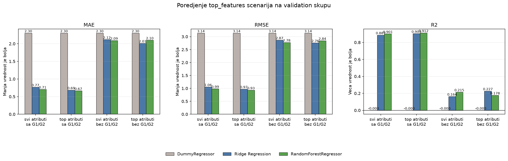

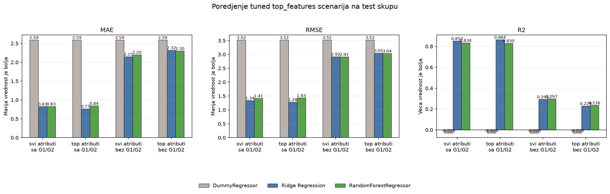

Rezultati pokazuju da je top features pristup posebno koristan u scenariju sa `G1/G2`. Kod `Ridge Regression` modela, smanjeni skup atributa daje bolji rezultat od punog skupa atributa. Test RMSE se smanjuje sa 1.3370 na 1.2796, a test R2 raste sa 0.8518 na 0.8642. To znači da je model sa 10 najvažnijih atributa ne samo jednostavniji, već i precizniji na test skupu.

Kod `RandomForestRegressor` modela u scenariju sa `G1/G2`, top features verzija ima nešto bolji validacioni RMSE, ali nešto slabiji test RMSE u odnosu na puni model. To pokazuje da poboljšanje na validacionom skupu ne mora uvek da se prenese na test skup. Zbog toga se rezultati ne tumače samo kroz jednu metriku, već se posmatraju zajedno validacioni rezultat, test rezultat, složenost modela i praktična upotrebljivost.

U scenariju bez `G1/G2`, top features modeli imaju nešto bolje validacione rezultate, ali slabije test rezultate. To znači da smanjenje broja atributa u ovom scenariju nije dovelo do bolje generalizacije. Razlog je verovatno to što, bez prethodnih ocena, model već raspolaže slabijim signalom, pa uklanjanje dodatnih atributa može izbaciti deo korisnih informacija koje zajedno pomažu predikciji.

Najvažniji zaključak je da se top features pristup najbolje pokazao kod `Ridge Regression` modela u scenariju sa `G1/G2`. Taj model koristi samo 10 atributa, postiže bolji test rezultat od punog Ridge modela i ostaje jednostavan za tumačenje. Zbog toga je ovaj scenario postao jedan od glavnih kandidata za izbor finalnog modela.

Top features analiza dodatno potvrđuje da `G1` i naročito `G2` nose najveći deo korisne informacije za predikciju završne ocene. Kada su ti atributi dostupni, moguće je napraviti precizan i jednostavan model. Kada nisu dostupni, čak ni izbor najznačajnijih atributa ne može potpuno nadoknaditi slabiji signal u podacima.

## 11. Izbor finalnog modela i analiza predikcija

Nakon poređenja osnovnih modela, podešavanja hiperparametara, analize značajnosti atributa i top features scenarija, izabran je finalni model. Cilj nije bio samo izabrati model sa dobrim numeričkim metrikama, već i model koji je dovoljno stabilan, jednostavan za tumačenje i praktičan za korišćenje.

Finalni model je eksportovan u:

```text
models/final/final_model.joblib
```

Prema `data/logs/step10_final_model_selection/final_model_report.csv`, izabran je sledeći model:

| Stavka | Vrednost |
| --- | --- |
| Scenario | `top_features_with_G1_G2` |
| Model | `Ridge Regression` |
| Parametar | `alpha=0.01` |
| Final test MAE | 0.7655 |
| Final test RMSE | 1.2737 |
| Final test R2 | 0.8655 |

Izabran je scenario `top_features_with_G1_G2`, jer je u prethodnim koracima pokazano da prethodne ocene `G1` i `G2` nose najviše korisnih informacija za predikciju završne ocene `G3`. Pored toga, top features verzija koristi samo 10 najvažnijih atributa, što model čini jednostavnijim za upotrebu i tumačenje u odnosu na model koji koristi sve atribute.

Kao finalni algoritam izabran je `Ridge Regression`. Iako je `RandomForestRegressor` u nekim fazama imao veoma dobre validacione rezultate, Ridge model je jednostavniji, stabilniji i lakši za interpretaciju. Kod Ridge modela se predikcija zasniva na linearnoj kombinaciji ulaznih atributa, uz regularizaciju koja smanjuje rizik od preteranog prilagođavanja trening podacima. To je posebno korisno kada se koriste enkodirani kategorijski atributi i kada je cilj da model bude razumljiv, a ne samo numerički dobar.

Važno je naglasiti da finalni model koristi `G1` i `G2`. To je njegova glavna prednost, ali i praktično ograničenje. Kada su prethodne ocene dostupne, model može veoma precizno da predvidi završnu ocenu. Međutim, ako se želi rana procena uspeha pre formiranja `G1` i `G2`, ovaj finalni model nije najpogodniji i tada bi trebalo koristiti slabiji, ali ranije primenljiv scenario bez `G1/G2`.

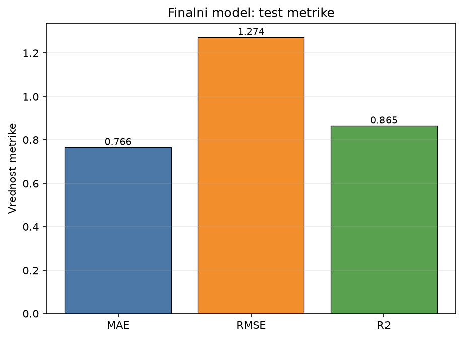

Metrike finalnog modela pokazuju da model ostvaruje dobar rezultat na test skupu. MAE od 0.7655 znači da model u proseku greši za manje od jedne ocene. Pošto je ciljna promenljiva `G3` izražena na skali od 0 do 20, ova greška je praktično mala i lako se tumači.

RMSE iznosi 1.2737. RMSE jače kažnjava veće greške od MAE, jer se greške kvadriraju pre računanja proseka. To znači da RMSE može biti veći kada postoje pojedinačni učenici kod kojih model napravi veću grešku. Pošto je RMSE i dalje relativno nizak, može se zaključiti da model uglavnom pravi male greške, uz moguće veće odstupanje kod manjeg broja učenika.

R2 iznosi 0.8655. To znači da model objašnjava veliki deo varijanse završne ocene na test skupu. Drugim rečima, model uspeva da objasni većinu razlika u završnim ocenama učenika koristeći dostupne ulazne atribute.

Graf stvarnih i predviđenih vrednosti prikazuje koliko su predikcije modela blizu stvarnih vrednosti. Na grafiku se porede stvarna ocena `G3` i predviđena ocena. Idealno bi bilo da sve tačke leže na dijagonali, jer bi to značilo da je svaka predikcija jednaka stvarnoj vrednosti.

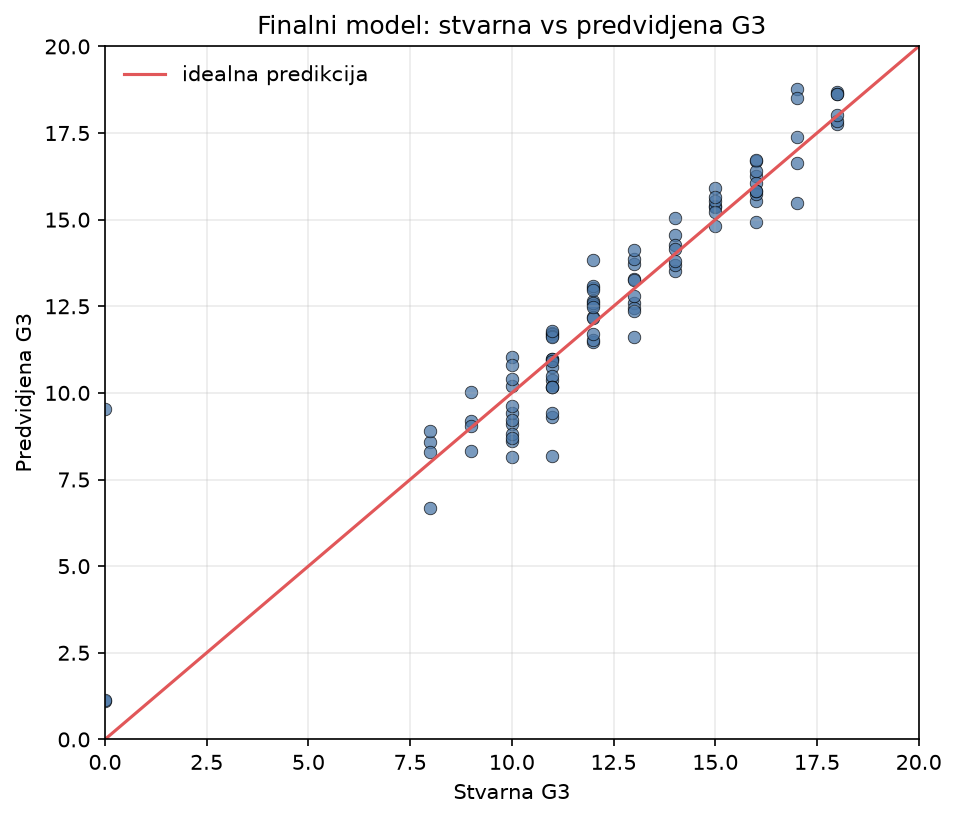

Tačke koje su blizu dijagonale predstavljaju dobre predikcije. Tačke koje su dalje od dijagonale predstavljaju slučajeve kod kojih je model napravio veću grešku. Ovaj graf je koristan jer ne prikazuje samo jednu zbirnu metriku, već omogućava vizuelnu proveru ponašanja modela kroz različite vrednosti završne ocene.

Residual graf prikazuje razliku između stvarne i predviđene vrednosti. Residual je definisan kao:

```text
residual = stvarna G3 - predviđena G3
```

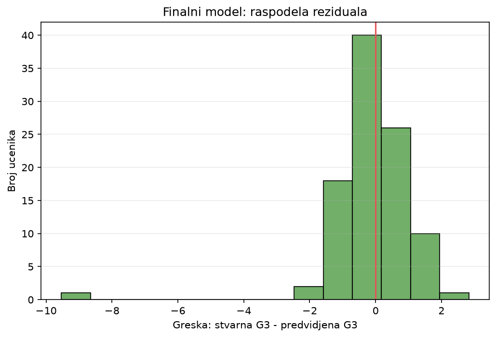

Ako je residual blizu nule, predikcija je dobra. Pozitivan residual znači da je stvarna ocena veća od predviđene, odnosno da je model potcenio učenika. Negativan residual znači da je stvarna ocena manja od predviđene, odnosno da je model precenio učenika.

Residual analiza je važna jer pokazuje da li model greši nasumično ili postoji neki obrazac u greškama. Ako bi residuali sistematski rasli ili opadali za određene vrednosti, to bi moglo značiti da model lošije radi za određenu grupu učenika ili određeni opseg ocena. U ovom slučaju, ukupne metrike i grafici pokazuju da model ima dobru tačnost, ali da i dalje postoje pojedinačni slučajevi kod kojih greška može biti veća.

Zaključak ovog koraka je da je `Ridge Regression` u scenariju `top_features_with_G1_G2` dobar izbor za finalni model. Model ostvaruje malu prosečnu grešku, objašnjava veliki deo varijanse završne ocene i koristi ograničen broj najvažnijih atributa. Njegova praktična upotrebljivost je najveća kada su dostupne prethodne ocene `G1` i `G2`, dok za raniju procenu uspeha treba imati u vidu slabije, ali ranije primenljive modele bez tih atributa.

## 12. Deployment modela

Nakon izbora finalnog modela, model je sačuvan tako da može ponovo da se učita i koristi za predikcije nad novim podacima. Finalni model se nalazi u folderu:

```text
models/final/
```

Sačuvan je kao `.joblib` fajl:

```text
models/final/final_model.joblib
```

Ovaj fajl ne sadrži samo regresioni model, već i kompletan preprocessing pipeline. To znači da su zajedno sa modelom sačuvani koraci za obradu ulaznih podataka, uključujući skaliranje numeričkih atributa i enkodiranje kategorijskih atributa. Zbog toga korisnik ne mora ručno da priprema podatke pre predikcije, već unosi originalne vrednosti atributa.

Pipeline interno radi sledeće korake:

1. prima ulazne vrednosti atributa;
2. numeričke atribute obrađuje pomoću `StandardScaler`;
3. kategorijske atribute obrađuje pomoću `OneHotEncoder`;
4. transformisane podatke prosleđuje finalnom Ridge modelu;
5. vraća predviđenu vrednost završne ocene `G3`.

Ovakav način čuvanja modela je važan jer sprečava razliku između načina obrade podataka tokom treniranja i tokom korišćenja modela. Isti preprocessing koji je korišćen tokom treniranja primenjuje se i nad novim podacima.

Finalni model očekuje 10 atributa iz scenarija `top_features_with_G1_G2`:

```text
G2, absences, G1, age, reason, freetime, health, Fedu, school, failures
```

To znači da nova predikcija mora sadržati vrednosti za ove atribute. Pošto model koristi `G1` i `G2`, njegova upotreba ima smisla onda kada su prethodne ocene učenika već dostupne.

Za lakše korišćenje modela dodati su pomoćni fajlovi:

| Fajl | Namena |
| --- | --- |
| `src/model_usage.py` | Učitava sačuvani model, priprema ulazne podatke i formatira rezultat predikcije |
| `src/predict.py` | Omogućava pokretanje predikcije iz terminala |
| `src/streamlit_app.py` | Omogućava unos podataka kroz jednostavnu web aplikaciju |

Fajl `model_usage.py` predstavlja zajednički deo za korišćenje modela. U njemu se učitava `.joblib` fajl, proverava se da li su prosleđeni potrebni atributi i poziva se pipeline za predikciju. Na taj način se izbegava ponavljanje istog koda u CLI i Streamlit verziji.

Predikcija iz terminala može se pokrenuti komandom:

```powershell
.\.venv\Scripts\python.exe .\src\predict.py
```

Primer pokretanja sa eksplicitno zadatim argumentima:

```powershell
.\.venv\Scripts\python.exe .\src\predict.py --G2 13 --absences 6 --G1 12 --age 15 --reason other --freetime 3 --health 3 --Fedu 1 --school GP --failures 0
```

U ovom primeru korisnik prosleđuje sve atribute koje finalni model očekuje. Program zatim učitava sačuvani model, formira ulazni zapis, primenjuje preprocessing i ispisuje predviđenu završnu ocenu.

Pored terminalskog pokretanja, napravljena je i Streamlit aplikacija. Ona omogućava korisniku da unese vrednosti atributa kroz jednostavan grafički interfejs, bez pisanja komandi u terminalu.

Streamlit aplikacija se pokreće komandom:

```powershell
streamlit run .\src\streamlit_app.py
```

Nakon pokretanja aplikacije, korisnik unosi vrednosti atributa u formu i dobija predikciju završne ocene `G3`. Ovaj način korišćenja je praktičniji za demonstraciju modela, jer omogućava interaktivno testiranje različitih ulaznih vrednosti.

## 13. Diskusija rezultata

Rezultati jasno pokazuju da dostupnost prethodnih ocena ima najveći uticaj na kvalitet predikcije završne ocene `G3`. Scenario sa `G1/G2` daje znatno bolje rezultate od scenarija bez tih atributa, što je u skladu sa eksplorativnom analizom podataka. Korelacija između `G2` i `G3` iznosi 0.92, dok korelacija između `G1` i `G3` iznosi 0.83. To znači da prethodne ocene nose veoma jak signal o završnom uspehu učenika.

Ovakav rezultat je očekivan. Završna ocena `G3` nije izolovana vrednost, već je prirodno povezana sa prethodnim uspehom učenika tokom školske godine. Zbog toga modeli koji imaju pristup atributima `G1` i `G2` mogu preciznije da procene konačan rezultat. Posebno je važan atribut `G2`, jer predstavlja bližu prethodnu ocenu u odnosu na završnu ocenu.

Scenario bez `G1/G2` ima slabije performanse, ali nije bez praktične vrednosti. Njegova prednost je u tome što može da se koristi ranije, pre nego što su prethodne ocene poznate. U tom slučaju model se oslanja na indirektnije informacije, kao što su prethodni neuspesi, izostanci, razlog izbora škole, želja za višim obrazovanjem, starost, vreme učenja, zdravstveno stanje i porodični kontekst.

Slabiji rezultati u scenariju bez `G1/G2` ne znače da je taj scenario beskoristan, već da dostupni atributi nose slabiji signal o završnoj oceni. Takav model može biti koristan za ranu procenu rizika, ali se njegove predikcije moraju tumačiti pažljivije. On može pomoći da se uoče učenici kod kojih postoji povećan rizik od slabijeg uspeha, ali ne može dostići preciznost modela koji koristi prethodne ocene.

Top features analiza pokazala je da smanjenje broja atributa može poboljšati model, ali samo u određenim uslovima. Najbolji rezultat postignut je kod `Ridge Regression` modela u scenariju `top_features_with_G1_G2`. Taj model koristi samo 10 najvažnijih atributa, a postiže bolji test rezultat od Ridge modela koji koristi sve atribute. To ukazuje da uklanjanje manje značajnih atributa može smanjiti šum i poboljšati generalizaciju.

Sa druge strane, top features pristup nije doneo bolje test rezultate u scenariju bez `G1/G2`. To pokazuje da smanjenje broja atributa nije automatski korisno. Kada model nema pristup jakim atributima kao što su `G1` i `G2`, i slabiji atributi mogu zajedno nositi deo korisne informacije. Njihovo uklanjanje može pogoršati sposobnost modela da generalizuje na neviđene podatke.

Izbor `Ridge Regression` modela kao finalnog modela ima smisla i sa praktične strane. Model je jednostavniji od Random Forest modela, lakši za tumačenje i pokazao je stabilan rezultat na test skupu. Random Forest je u nekim koracima imao bolje validacione rezultate, ali se ti rezultati nisu uvek preneli na test skup. Zbog toga je pri izboru finalnog modela posmatrana kombinacija više faktora: validacioni rezultat, test rezultat, jednostavnost modela, broj korišćenih atributa i praktična interpretabilnost.

Finalni model može biti koristan kao alat za podršku u proceni očekivanog uspeha učenika, ali ne treba da bude jedini osnov za donošenje odluka. Predikcija modela može pomoći nastavnicima ili analitičarima da bolje razumeju rizik i očekivani rezultat, ali obrazovni kontekst uključuje i faktore koji nisu nužno obuhvaćeni dataset-om. To mogu biti promene motivacije, kvalitet nastave, podrška nastavnika, zdravstvene okolnosti, porodični događaji ili drugi faktori koji utiču na uspeh učenika.

Glavna ograničenja rada su:

- dataset je ograničen na dostupne atribute;
- finalni model koristi `G1` i `G2`, pa nije pogodan za procenu pre pojave tih ocena;
- scenario bez `G1/G2` je praktično ranije primenljiv, ali znatno manje precizan;
- model predviđa numeričku ocenu, ali ne objašnjava uvek uzrok slabog ili dobrog uspeha;
- rezultati zavise od kvaliteta, obima i reprezentativnosti originalnog dataset-a;
- model nije dodatno proveren na potpuno nezavisnom spoljašnjem dataset-u.

Moguća unapređenja uključuju rad sa većim i raznovrsnijim skupom podataka, dodatnu proveru na spoljnim podacima, detaljniju analizu grešaka po grupama učenika i razvoj posebnog modela za ranu identifikaciju učenika pod rizikom. Posebno bi bilo korisno dalje razvijati scenario bez `G1/G2`, jer je on slabiji po metrikama, ali ima veću vrednost za ranu intervenciju.

## 14. Zaključak

Cilj rada bio je da se napravi model za predikciju završne ocene učenika `G3` na osnovu dostupnih školskih, porodičnih i socijalnih atributa iz dataset-a `student-por.csv`. Problem je tretiran kao regresioni zadatak, jer je ciljna promenljiva numerička ocena na skali od 0 do 20.

Dataset je prvo pregledan i pripremljen za dalju analizu. Provereni su broj redova i kolona, tipovi atributa, nedostajuće vrednosti, duplikati i osnovne statistike. Dodatno su analizirane ekstremne i retke vrednosti, pri čemu nisu pronađene očigledne greške koje zahtevaju ručno uklanjanje. Preprocessing je organizovan kroz `Pipeline`, gde se numerički atributi skaliraju pomoću `StandardScaler`, a kategorijski atributi enkodiraju pomoću `OneHotEncoder`. Time je smanjen rizik od data leakage-a.

Eksplorativna analiza podataka pokazala je da atributi `G1` i `G2` imaju najjaču vezu sa završnom ocenom `G3`. Zbog toga su od početka posmatrana dva scenarija: jedan u kome se koriste `G1` i `G2`, i drugi u kome se oni uklanjaju. Na taj način je upoređena maksimalna prediktivna tačnost modela sa praktičnijom ranom procenom, kada prethodne ocene još nisu dostupne.

Trenirani su baseline model, `Ridge Regression` i `RandomForestRegressor`. Nakon početnog poređenja sprovedeno je podešavanje hiperparametara pomoću ručnog grid search-a. Modeli su poređeni na validacionom skupu, dok je test skup korišćen za proveru ponašanja na neviđenim podacima. Rezultati su pokazali da scenario sa `G1/G2` daje znatno bolje performanse od scenarija bez tih atributa.

Analiza značajnosti atributa potvrdila je da `G2` ima dominantan značaj kada su prethodne ocene dostupne. Kada se `G1` i `G2` uklone, model se oslanja na slabije i indirektnije pokazatelje, kao što su `failures`, `absences`, `studytime`, `higher`, `school`, `reason` i drugi atributi. Na osnovu feature importance analize formirani su top features scenariji sa 10 najvažnijih atributa.

Najbolji konačni rezultat postignut je modelom `Ridge Regression` u scenariju `top_features_with_G1_G2`. Finalni model koristi 10 atributa i eksportovan je u:

```text
models/final/final_model.joblib
```

Finalni rezultati na test skupu su:

| Metrika | Vrednost |
| --- | ---: |
| MAE | 0.7655 |
| RMSE | 1.2737 |
| R2 | 0.8655 |

MAE od 0.7655 znači da model u proseku greši za manje od jedne ocene. RMSE od 1.2737 pokazuje da postoje pojedinačni slučajevi sa većom greškom, ali da su greške ukupno relativno male. R2 od 0.8655 pokazuje da model objašnjava veliki deo varijanse završne ocene na test skupu.

Finalni model je pripremljen i za praktično korišćenje. Sačuvan je zajedno sa preprocessing pipeline-om, tako da korisnik može uneti originalne vrednosti atributa, dok se skaliranje i enkodiranje obavljaju automatski. Dodati su i primeri za korišćenje kroz terminal i Streamlit aplikaciju.

Glavni zaključak je da se završna ocena učenika može relativno precizno predvideti kada su dostupne prethodne ocene `G1` i `G2`. U tom slučaju model postiže dobru tačnost i može biti koristan kao pomoćni alat za procenu očekivanog uspeha. Scenario bez `G1/G2` ostaje važan jer omogućava raniju procenu, ali njegove rezultate treba posmatrati kao manje precizne i više orijentisane ka identifikaciji potencijalnog rizika nego ka tačnoj predikciji završne ocene.
